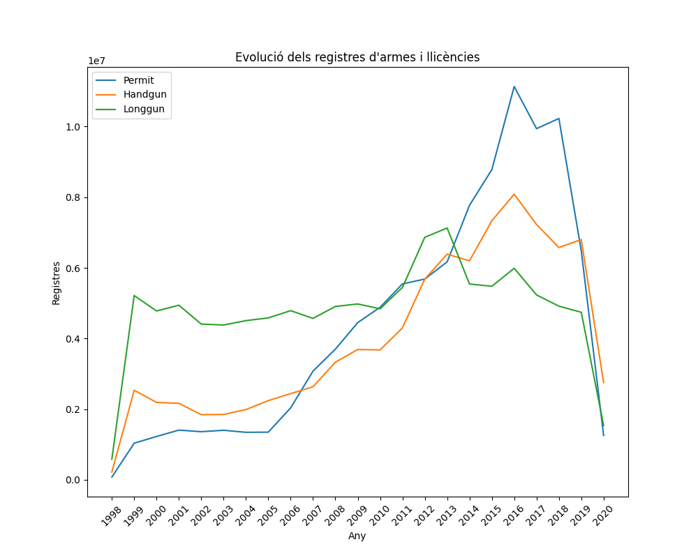

# Introduction
This is the last activity of course 22410 of the Master's in Data Science. For this project we analyse the evolution and tendencies of the weapon's permits, handguns and longguns ownerships in the US. 

# Project organization
The project is organized as follows:

activity_4\
|\
|__Data (Folder to store the data)\
| |__nics-firearm-background-checks.csv\
| |__us-state-populations.csv\
|\
|__modules (Folder with modules containing the functions used in main.py)\
| |__data_exploration.py\
| |__data_visualisation.py\
| |__reading_processing.py\
|\
|__graphics (Folder to store the graphical results in image/html format)\
|\
|__tests (Folder with .py files containing the tests)\
| |__test_ex1.py\
| |__test_ex2.py\
| |__test_ex3.py\
| |__test_ex5.py\
|\
|__README.md\
|__main.py\
|__requirements.txt\


# Script execution
## Inputs

For the program to run correctly, a numerical input within the range [0, 6] must be provided. This number will determine the exercise to execute.
If you want to execute all the exercises at once, pass the argument 0. If you want to execute only exercise 1, pass 1 as an argument.

## Execution Steps

1. ```cd ./activity_4```
2. ```pip install -r requirements.txt```
3. ```python3 main.py **[0, 6]**```

## Exercise results

The program displays a series of checks on the screen and exports some graphs in .svg and .html format to the activity_4/graphics folder.


# Main results


As observed in the graph, US experienced a constant increase in weapons permits since 2005. The ownership of long and hand guns has also increased but at a lower rate. The permits reached a peak in 2016 and hold those rates until 2019. A reason behind this maximums could be the often occurrences of mass shootingss and political inestability, among others.


