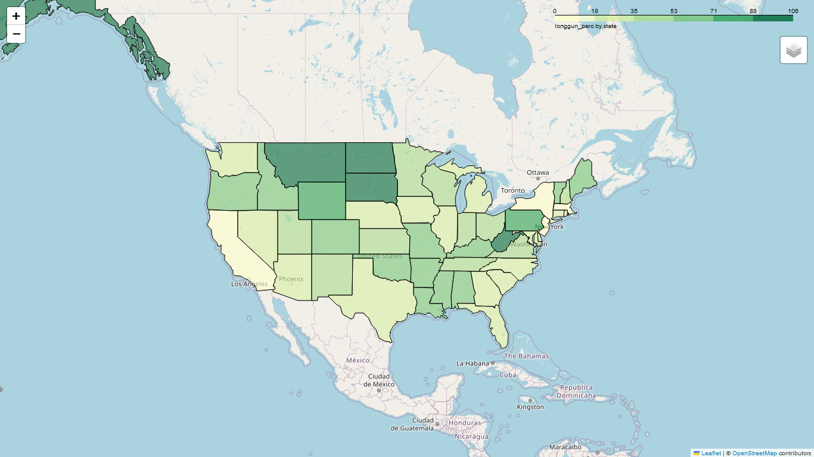

# Introduction
This is the last activity of course 22410 of the Master's in Data Science. For this project we analyse the evolution and tendencies of the weapon's permits, handguns and longguns ownerships in the US. 

# Project organization
The project is organized as follows:

activity_4\
|\
|__Data (Folder to store the data)\
||__nics-firearm-background-checks.csv\
||__us-state-populations.csv\
|\
|__modules (Folder with modules containing the functions used in main.py)\
| |__data_exploration.py\
| |__data_visualisation.py\
| |__reading_processing.py\
|\
|__graphs (Folder to store the graphical results in image/html format)\
|\
|__tests (Folder with .py files containing the tests)\
| |__test_ex1.py\
| |__test_ex2.py\
| |__test_ex3.py\
| |__test_ex5.py\
|\
|__README.md\
|__main.py\
|__requirements.txt\


# Script execution
## Inputs

For the program to run correctly, a numerical input within the range [0, 6] must be provided. This number will determine the exercise to execute.
If you want to execute all the exercises at once, pass the argument 0. If you want to execute only exercise 1, pass 1 as an argument.

## Execution Steps

1. ```cd ./activity_4```
2. ```pip install -r requirements.txt```
3. ```python3 main.py **[0, 6]**```

## Exercise results

The program displays a series of checks on the screen and exports some graphs in .png format to the activity_4/graphs folder.


# Main results
## Time evolution of permits and ownerships


As observed in the graph, US experienced a constant increase in weapons permits since 2005. The ownership of long and hand guns has also increased but at a lower rate. The permits reached a peak in 2016 and hold those rates until 2019. A reason behind this maximums could be the often occurrences of mass shootingss and political inestability, among others.

## Proportion of Hand guns ownership per Capita by State


The graph shows the relative value of hand gun ownership per state. The greater the proportion the darker the area. As noted, the states of Alaska, Tennesse and West Virginia are the ones with a higher proportion of hand guns with respect to its population. 

## Proportion of Long guns ownership per Capita by State


The above map shows the proportion of Long guns ownerships per State. Similar to the previous map, Alaska has also the greatest proportion of Long guns ownership. Montana, South Dakota and North Dakota have also large proportions compared to the rest of States. These values indicate that almost every person in these states own a long gun. 

## Proportion of permits per Capita by State


When it comes to proportion of permits for weapons, Utah is the leader by a notable difference. 